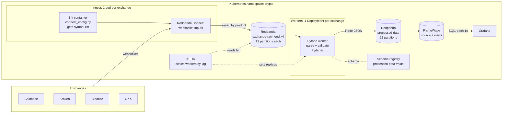
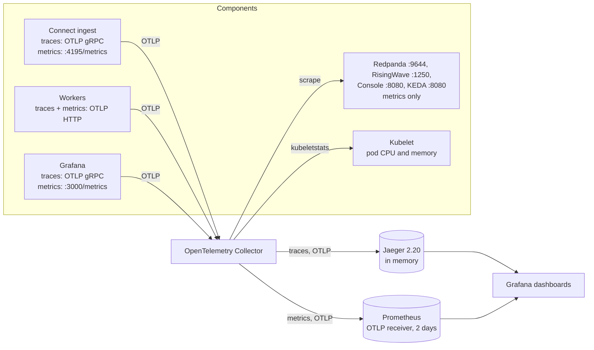

# Crypto stream: architecture v1 (L1 market data)

Status: running on Docker Desktop Kubernetes, 2026-09-23.
This document describes the version before L2 (order book) data. Section 13 describes observability.

## 1. Summary

The system reads live market data from 4 cryptocurrency exchanges, changes it to one format,
and shows it on a live dashboard.

- **Exchanges:** Coinbase, Kraken, Binance and OKX.
- **Symbols:** all USD pairs (Coinbase, Kraken) and all USDT pairs (Binance, OKX). This is 1,926 symbols.
- **Data:** trades and the best bid and ask (L1). See section 7.
- **Load, measured:** about 1,400 raw messages each second in, about 400 trades each second out.
- **Dashboard refresh:** 1 second.

## 2. Data flow



One trade goes through these steps:

1. The exchange sends a websocket message to the ingest pod of that exchange.
2. Redpanda Connect writes the message, unchanged, to `<exchange>-raw-feed`. The Kafka key is the product.
3. A worker of that exchange reads the message. It parses and validates the message, then adds the last best bid and ask of that product.
4. The worker writes one `Trade` record to `processed-data`.
5. RisingWave reads `processed-data` and updates its views.
6. Grafana queries the views each second.

## 3. Components

| Component | Kind | Image | Job |
|---|---|---|---|
| `redpanda` | StatefulSet, 1 pod, 20 Gi volume | `redpandadata/redpanda` | Kafka API, schema registry |
| `topics` | Job | `redpandadata/redpanda` | Makes the topics and sets their retention |
| `schema` | Job | `crypto-worker:dev` | Puts the `Trade` JSON schema in the registry |
| `<exchange>-ingest` | Deployment, 1 pod each | init: `crypto-worker:dev`, main: `redpandadata/connect` | Websocket to Kafka |
| `<exchange>-worker` | Deployment, 1 to 12 pods (KEDA) | `crypto-worker:dev` | Raw message to `Trade` |
| `risingwave` | Deployment, 1 pod, `single_node`, 20 Gi volume | `risingwavelabs/risingwave` | Streaming SQL views |
| `rw-init` | Job | `postgres:17-alpine` | Runs `init.sql` in RisingWave |
| `grafana` | Deployment | `grafana/grafana` | Dashboard |
| `live` | Deployment | `crypto-live:dev` (`live/`) | Live page: pushes view changes to the browser (section 14) |
| `fluss` | StatefulSet, 1 pod: ZooKeeper, coordinator, tablet server; 20 Gi volume | `apache/fluss:1.0.0`, `zookeeper:3.9.2` | Streaming storage for the live page (section 15) |
| `flink-jobmanager`, `flink-taskmanager` | Deployments | `crypto-flink:dev` (`flink/`) | The Flink job `crypto-live` (section 15) |
| `console` | Deployment | `redpandadata/console` | Web UI for topics, groups and schemas |
| KEDA | 3 pods in namespace `keda` | KEDA 2.21.0 | Autoscaling by consumer lag |
| `otel-collector` | Deployment | `otel/opentelemetry-collector-contrib` | Receives and scrapes all telemetry (section 13) |
| `jaeger` | Deployment | `jaegertracing/jaeger:2.20.0` | Traces, in memory |
| `prometheus` | Deployment | `prom/prometheus` | Metrics, 2 days, OTLP receiver |

The 3 Jobs can run again safely. They check what exists before they change anything.

### URLs

| URL | What |
|---|---|
| http://localhost:3000 | Grafana, no login |
| http://localhost:8080 | Redpanda Console |
| `localhost:4566`, user `root`, database `dev` | RisingWave, Postgres protocol |
| http://localhost:3000/d/pipeline-health | Grafana, Pipeline Health dashboard |
| http://localhost:3000/d/k8s | Grafana, Kubernetes dashboard |
| http://localhost:16686 | Jaeger UI |
| http://localhost:9090 | Prometheus UI |

Docker Desktop serves `LoadBalancer` services on `localhost`.

## 4. Ingest

### 4.1 How the symbol list is made

The symbol list is not in the code. Each ingest pod makes it when it starts:

1. The init container runs `python connect_config.py <exchange>`.
2. `connect_config.py` imports the module of that exchange (`worker/<exchange>.py`) and calls `symbols()`.
3. `symbols()` makes one HTTP GET to the public REST API of the exchange. No API key is necessary.

   | Exchange | Endpoint | Kept | Count |
   |---|---|---|---|
   | Coinbase | `api.exchange.coinbase.com/products` | quote `USD`, status `online`, trading not disabled | 402 |
   | Kraken | `api.kraken.com/0/public/AssetPairs` | quote `USD`, status `online` | 622 |
   | Binance | `api.binance.com/api/v3/exchangeInfo` | quote `USDT`, status `TRADING` | 496 |
   | OKX | `www.okx.com/api/v5/public/instruments` | quote `USDT`, state `live` | 406 |

4. The `BASES` setting filters the list. `*` keeps all. `BTC,ETH` keeps only those base assets.
5. The list is split into groups, one websocket connection for each group.
6. `inputs()` of the module makes the subscribe message for each group.
7. The init container writes the complete Connect config to a shared `emptyDir` volume. Connect then starts with it.

Kraken: the REST API uses the old names `XBT` and `XDG`, but the websocket uses `BTC` and `DOGE`.
`worker/kraken.py` changes the names.

### 4.2 Websocket connections

| Exchange | Channels | Symbols for each connection | Connections |
|---|---|---|---|
| Coinbase | `ticker` | 200 | 3 |
| Kraken | `trade`, `ticker` (one connection for each channel) | 200 | 8 |
| Binance | `<symbol>@trade`, `<symbol>@ticker` | 80 | 7 |
| OKX | `trades`, `tickers` | 200 | 3 |

Binance rejects a subscribe message over 4,096 bytes. 80 symbols make about 3,000 bytes.
Each module sets its own `MAX_CHUNK` if it needs a lower limit.

### 4.3 Kafka key

Connect sets the Kafka key to the product (`KEY` in each module, a Bloblang path, for example `this.data.s` on Binance).
All messages of one product go to one partition, in order. The worker needs this order: it adds the last
quote of a product to each trade of that product, so the quote and the trade must reach the same worker.
Control messages (subscribe results, heartbeats) have no product and get an empty key.

## 5. Topics

| Topic | Partitions | Retention | Content |
|---|---|---|---|
| `coinbase-raw-feed`, `kraken-raw-feed`, `binance-raw-feed`, `okx-raw-feed` | 12 each | 1 hour | Exchange messages, unchanged |
| `processed-data` | 12 | 2 hours | `Trade` records, JSON |
| `_schemas` | 1 | | Schema registry |

Automatic topic creation is off (`auto_create_topics_enabled: false`, set in the Redpanda bootstrap file).
Only the `topics` Job makes topics, so each topic always has the correct partition count.

The partition count sets the maximum number of workers for a feed: a consumer group cannot use more workers than partitions.

## 6. Workers

### 6.1 Code structure

```
worker/
  utils.py           shared: Pydantic models, quote and trade merge, Kafka loop, schema registration
  coinbase.py        KEY, symbols(), inputs(), parse()
  kraken.py          same functions
  binance.py         same functions
  okx.py             same functions
  connect_config.py  makes the Connect config for one exchange
  test_workers.py    tests for all parsers, and a throughput measurement
  Dockerfile         python:3.12-slim + confluent-kafka + pydantic
```

All the knowledge about one exchange is in one file. `parse()` changes one raw message into
events of 2 types, `Quote` and `Fill`. `utils.process()` does the rest:

- A `Quote` updates the order book memory of that product (best bid, best ask, 24 h volume).
- A `Fill` becomes a `Trade`, with the last quote of that product added.

### 6.2 Schema

The `Trade` Pydantic model is the contract of `processed-data`:

| Field | Type | Meaning |
|---|---|---|
| `exchange` | string | `coinbase`, `kraken`, `binance` or `okx` |
| `product_id` | string | `BASE-QUOTE`, for example `BTC-USD` or `BTC-USDT` |
| `ts` | datetime | Trade time, from the exchange clock |
| `side` | `buy` or `sell` | Side of the taker |
| `price` | float | Trade price |
| `last_size` | float | Trade quantity, in the base asset |
| `best_bid`, `best_ask` | float, optional | Last known top of book for this product |
| `spread` | float, optional | `best_ask - best_bid` |
| `volume_24h` | float, optional | 24 hour volume, in the base asset |

The optional fields are empty until the worker receives the first quote of the product.

The `schema` Job puts the JSON schema of `Trade` in the Redpanda schema registry, subject `processed-data-value`.
The registry refuses a change that breaks compatibility. Each worker pod has an init container that waits until the schema is registered.
Messages are plain JSON. They do not contain a schema ID.

### 6.3 Error handling

- A message that fails Pydantic validation, or has a missing field, is skipped. The worker writes a `skip` line to its log and continues.
- On `SIGTERM` (scale-down, rollout), the worker leaves the consumer group and flushes the producer. The partitions move at once, not after the session timeout.
- The consumer commits its position each 1 second. After a crash, up to 1 second of messages is processed again, so those trades can show 2 times in RisingWave.

### 6.4 Consumer settings

| Setting | Value | Why |
|---|---|---|
| `group.id` | `<exchange>-worker` | One group for each feed |
| `auto.commit.interval.ms` | 1000 | Reported lag stays close to the real lag. The default of 5 s made the reported lag go from 0 to about 400 and back. |
| `partition.assignment.strategy` | `cooperative-sticky` | A rebalance moves only the partitions that change owner |
| `session.timeout.ms` | 10000 | A dead pod loses its partitions after 10 s |

## 7. Market data level

This version ingests **L1 data plus trades**. It does not ingest L2.

| Level | Content | In v1 |
|---|---|---|
| L1 | Best bid and best ask (top of book) | Prices: yes. Sizes: no. |
| Trades | Each trade: time, price, quantity, taker side | Yes |
| L2 | Total size at each price level (order book depth) | No |
| L3 | Each single order | No |

| Exchange | Quote source | Update rate |
|---|---|---|
| Coinbase | `ticker` (one message for each trade, with best bid and ask) | On each trade |
| Kraken | `ticker` | On each trade (the default `event_trigger: trades`). A bid or ask change without a trade is not sent. |
| Binance | `@ticker` (24 h ticker) | **Once each second** |
| OKX | `tickers` | On a trade or a bid or ask change, at most once each 100 ms |

The Binance spread can be up to 1 second old. `@bookTicker` gives real-time top of book, but it adds many messages.

## 8. RisingWave

`k8s/init.sql` makes these objects:

| Object | Kind | Keeps | Used by |
|---|---|---|---|
| `trades` | Source (stores nothing), watermark 30 s | | All views |
| `ticks` | View: all trades | 15 minutes | Last 20 trades |
| `candles_1m` | View: open, high, low, close, volume by exchange, product, minute | 1 day | Candle chart |
| `prices_1s` | View: last price, average spread, trade count by exchange, product, second | 15 minutes | Price and spread charts |
| `exchange_rate_1s` | View: trades each second by exchange | 15 minutes | All-symbol rate chart |
| `latest` | View: last price, spread, 24 h volume by exchange and product | All products | Latest table, asset list |

Two mechanisms keep memory use flat:

- **Temporal filters** (`WHERE window_start > now() - INTERVAL ...`) delete old rows from each view.
  The filter is after the aggregation. A filter before the aggregation would make RisingWave remove each
  old trade from its window again, so it would have to store every trade.
- **The watermark** on `trades.ts` tells RisingWave when a window is closed, so it can delete the state of that window.

## 9. Scaling

KEDA has one `ScaledObject` for each worker Deployment:

- Trigger: Kafka consumer lag of `<exchange>-worker` on `<exchange>-raw-feed`.
- `lagThreshold`: 1000. KEDA runs about total lag / 1000 workers.
- Minimum 1, maximum 12 (the partition count).

Measured, all 1,926 symbols:

| Feed | Messages each second |
|---|---|
| OKX | 833 |
| Binance | 468 |
| Coinbase | 45 |
| Kraken | 30 |
| `processed-data` (out) | 384 |

One worker processes about 14,000 messages each second in the cluster. The test: OKX was paused for 4 minutes,
and then 1 worker cleared 196,212 messages of lag in about 14 seconds. The HPA checks each 15 seconds, so KEDA
did not add pods. At the current load, each feed needs less than 10% of one worker. Autoscaling becomes
necessary at more than about 10 times the current load, for example with L2 data.

## 10. Resources

| Pod | CPU request | Memory request / limit |
|---|---|---|
| Redpanda (`--smp=2 --memory=2G`) | 1 | 2 Gi / 3 Gi |
| RisingWave | 1 | 4 Gi / 8 Gi |
| Each worker | 100m (limit 1) | 128 Mi / 512 Mi |

RisingWave needs a limit of about 8 Gi: with less, its compactor gets too little memory and RisingWave stops at startup.
The Docker Desktop VM has 16 GB.

## 11. Operations

```bash
# build the worker image and load it into the kind node (after each code change)
docker build -t crypto-worker:dev worker
docker save crypto-worker:dev | docker exec -i desktop-control-plane ctr -n k8s.io images import -

# deploy or update
kubectl apply -k k8s

# restart the pods that use the worker image
kubectl -n crypto get deploy -o name | grep -E 'ingest|worker' | xargs kubectl -n crypto rollout restart

# consumer lag of one feed
kubectl -n crypto exec redpanda-0 -- rpk group describe okx-worker

# worker tests
docker run --rm crypto-worker:dev python test_workers.py
```

The Docker Desktop cluster is the kind type, so it does not see local images. Each new image must be imported into the node.

### Add an exchange

1. Add `worker/<exchange>.py` with `KEY`, `symbols()`, `inputs()` and `parse()`.
2. Add tests for `parse()` to `worker/test_workers.py`.
3. Copy `k8s/exchanges/coinbase.yaml` and replace `coinbase` everywhere.
4. Add the new file to `k8s/kustomization.yaml`, and the topic to the loop in `k8s/jobs.yaml`.

## 12. Known limits

| Limit | Effect | Upgrade |
|---|---|---|
| The symbol list is fetched only at pod start | New listings are not ingested until the ingest pod restarts | Restart the ingest pods on a schedule, or refresh the list while the pod runs |
| One ingest pod for each exchange | If the pod stops, that exchange has a gap. A second replica would send each message 2 times. | Split the symbols over more ingest pods |
| Watermark 30 s | A trade more than 30 s older than the newest trade is dropped from all views. The 4-minute OKX test lost those minutes. | A longer watermark, with more open windows in memory |
| RisingWave `single_node` | One pod with one volume: no failover, and the pod must be on the node that has the volume | RisingWave Helm chart with a separate meta store and object storage |
| Quote memory is in the worker | After a rebalance, `spread` is empty until the next quote of the product | Keep quotes in a compacted topic |
| Binance quotes once each second | The Binance spread can be 1 s old | `@bookTicker` |
| Bid and ask sizes are not kept | No depth or liquidity information | L2 (next version) |
| At-least-once delivery | After a worker crash, up to 1 s of trades can show 2 times | Deduplicate by exchange trade ID in RisingWave |
| Single Redpanda broker | No replication | 3 brokers with replication factor 3 |
| Jaeger and Prometheus store in memory or `emptyDir` | Traces and metrics are lost on restart | Jaeger with Badger or Elasticsearch, Prometheus with a PVC |
| Jaeger pinned to 2.20.0 | No Jaeger updates | Update when the Grafana Jaeger data source uses `/api/v3` |

## 13. Observability



Every metric and every trace goes through the collector (`k8s/otel-collector.yaml`). Nothing sends to
Jaeger or Prometheus directly, and Prometheus scrapes nothing itself.

### 13.1 Traces

| Source | How | Sampling |
|---|---|---|
| Connect (ingest) | `tracer: open_telemetry_collector`, gRPC | 1% (`TRACE_RATIO`) |
| Workers | OpenTelemetry Python SDK, OTLP HTTP | Follows the parent (Connect) decision |
| Grafana | `GF_TRACING_OPENTELEMETRY_*` | 5% |

One trace follows one raw message through the pipeline:

| Span | Service | Typical time |
|---|---|---|
| `input_websocket` | `<exchange>-ingest` | Covers the whole Connect part |
| `mutation` | `<exchange>-ingest` | < 1 ms |
| `output_kafka_franz` | `<exchange>-ingest` | 10 to 15 ms (produce with ack) |
| `process <exchange>` | `<exchange>-worker` | < 0.5 ms |

Connect puts the W3C `traceparent` of the message in a Kafka header (`meta traceparent = tracing_span().traceparent`,
output `metadata.include_patterns`). The worker reads it and starts its span as a child. The worker also writes
`traceparent` to each record on `processed-data`. RisingWave has no tracing, so the trace ends at the worker.

Redpanda, RisingWave, Console, KEDA and Prometheus do not send traces.

### 13.2 Metrics

| Source | How | Examples |
|---|---|---|
| Workers | OTLP push, each 10 s | `worker_messages_total{exchange,result}`, `worker_trades_total`, `worker_process_duration_milliseconds`, `trade_latency_milliseconds` (corrected to NTP time), `clock_offset_milliseconds{reference}` |
| Connect | Scrape `:4195/metrics` | `output_sent_total`, `input_received_total` |
| Redpanda | Scrape `:9644/public_metrics` | `redpanda_kafka_consumer_group_lag_sum{redpanda_group}`, `redpanda_kafka_request_bytes_total` |
| RisingWave | Scrape `:1250/metrics` | `stream_source_output_rows_counts_total`, `meta_barrier_duration_seconds` |
| Grafana, Console | Scrape | HTTP request metrics |
| KEDA | Scrape `keda-operator.keda:8080` | `keda_scaler_metrics_value` (the lag that KEDA uses) |
| Kubelet | `kubeletstats` receiver | `k8s_pod_cpu_usage`, `k8s_pod_memory_working_set_bytes` |
| Collector | Scrape itself `:8888` | `otelcol_exporter_sent_spans_total`, `otelcol_exporter_send_failed_*` |

A pod is scraped when it has the annotations `prometheus.io/scrape: "true"` and `prometheus.io/port`
(and `prometheus.io/path` if not `/metrics`).

`trade_latency_milliseconds` is the most useful single metric: it measures the time from the trade on the
exchange to the worker, so it shows a delay in any part before RisingWave. More than 30 s means RisingWave drops the trade.

Settings that were necessary:

- Redpanda: `enable_consumer_group_metrics` must include `consumer_lag` (set by the `topics` Job).
- RisingWave: `RW_SINGLE_NODE_PROMETHEUS_LISTENER_ADDR=0.0.0.0:1250`. The default listens on 127.0.0.1 only.
- Workers: `service.instance.id` = pod name, so the metrics of 2 replicas do not overwrite each other.
- Jaeger is pinned to 2.20.0: 2.21 removed the `/api/*` JSON API, and the Grafana 13.2 Jaeger data source still uses it.

### 13.3 Dashboards

| Dashboard | Data source | Content |
|---|---|---|
| Crypto Live (home) | RisingWave | Market data |
| Pipeline Health | Prometheus, Jaeger | Throughput, lag, worker pods, trade latency, parse time, Redpanda and RisingWave, pod CPU and memory, collector, recent traces |

RisingWave consumer groups (`rw-consumer-*`) are left out of the lag panel. RisingWave keeps its offsets
inside itself and does not commit them, so their lag grows without meaning.

### 13.4 What observability found

The first view of the Pipeline Health dashboard showed OKX trades 2 minutes late and growing, and RisingWave
dropped almost all OKX trades (watermark). The cause: Connect sent each message to Kafka alone, with at most
10 in flight. At about 12 ms for each produce, that is at most about 860 messages each second, and OKX sends 1,000 to 1,300.
The first fix was output batches (`batching: {count: 1000, period: 20ms}`, `max_in_flight: 64`):
OKX exchange to Kafka went from 120 s to 0.12 s (p50).

A later measurement showed where the 12 ms of each write go: Redpanda acks a produce in 0.8 ms (p50), and
the Kafka client in Connect (franz-go) waits 10 ms before it sends a request (its default `linger`, which
Connect cannot change). About 110 ms of the 123 ms from OKX to Kafka happen before Connect: at the exchange
and on the network.

**Message order.** A check of the trade IDs showed that Connect wrote the messages of one product out of
order (on Binance, 25% to 35% of the steps went backwards). There were 2 causes, and each one alone reorders:

| Setting | Why it reorders | Now |
|---|---|---|
| `pipeline.threads` (default: 1 for each CPU) | Several threads run the processors, and messages leave them in any order | 1 |
| `max_in_flight` above 1 | Writes that are in flight at the same time reach Redpanda in any order | 1, with batches of up to 2,000 messages or 5 ms |

With both at 1, the trade IDs of Coinbase, Kraken and Binance count up by 1 for each product, with no step
backwards (measured on about 55,000 trades). Order costs speed: Connect needs about 24 ms for each message,
compared with 10 ms with 256 writes in flight. The worker needs the order to add the correct quote to each
trade, and gap detection needs it to find missing trade IDs.

The same view showed about 0.6 skipped OKX messages each second: OKX sends an empty bid or ask for a market
with no orders on one side. The parser now ignores those quotes.

## 14. Live page

http://localhost:8000, in the style of the RisingWave interactive demos.

```
RisingWave view --CREATE SUBSCRIPTION--> change rows (op: Insert, UpdateInsert, Delete, ...)
   --FETCH, 1 thread for each subscription--> live/server.py --Server-Sent Events--> browser
```

| Part | Content |
|---|---|
| Trade tape (`ticks_sub`) | New orders enter at the top, and older rows move down. No row is sorted again. |
| `latest` (`latest_sub`) | The SQL of the view, next to its rows. A row flashes green or red when its price changes. |
| `price_gap` (`price_gap_sub`) | The price gap between exchanges for each asset on 3 or more exchanges, top 15 |

- **One row is one taker order.** An order that fills several resting orders arrives as several trades with the
  same exchange, product, side and time. The page adds them together (column `fills`). A burst of 80 Binance fills is one row.
- **Min value** (default $1k) hides small orders, so the tape moves slowly enough to read. `pause` keeps new orders until you resume.
- The SQL on the page is read from `init.sql` at runtime (the `rw-init` ConfigMap), so it always matches the running views.
- `price_gap` leaves out gaps over 5%: those are almost always 2 different tokens with the same ticker (for example LUNA).
- The live page has no metrics or traces.

## 15. Flink and Fluss for the live page

The live page has 2 sources. The default is a Flink job that writes Fluss tables; RisingWave is the other.
Grafana still reads RisingWave.

```
processed-data (Kafka) --> Flink job crypto-live (k8s/flink-live.sql)
                              |- trades     (Fluss log table, 1 h)          every trade
                              |- latest     (Fluss key table: exchange, product)   last price
                              '- price_gap  (Fluss key table: asset)        gap between exchanges
Fluss tables --> live/fluss_source.py (pyfluss: log and change-log scanners, limit scans) --> the page
```

| Part | Detail |
|---|---|
| Fluss | 1.0.0. One pod: ZooKeeper, a coordinator (port 9123) and a tablet server (9124), which share a volume for "remote" data. Listeners: `INTERNAL` inside the pod, `CLIENT` advertised as `fluss.crypto.svc.cluster.local`. |
| Flink | 1.20.3 (Java 17), with `fluss-flink-1.20:1.0.0` and `flink-sql-connector-kafka:3.4.0-1.20`. One JobManager, one TaskManager (4 slots). Web UI on port 8081. |
| Job start | A Flink session cluster without HA forgets its jobs when the JobManager restarts. A `submitter` container in the JobManager pod (`flink/submit.sh`) checks every 30 s and submits the SQL again if the job is missing. The SQL comes from a ConfigMap, so a SQL change needs no image build. |
| State | The job keeps the last price of each product itself (`latest_prices`, about 2,000 rows) and builds `price_gap` from it. Checkpoints every 10 s, kept in the JobManager's memory. After a JobManager restart, the job starts from the end of the topic. |
| Fluss writer | Waits up to 100 ms by default to collect rows (`client.writer.batch-timeout`). Set to 5 ms with a hint on each `INSERT`, because the catalog does not accept writer options. |
| Live server | `?source=fluss` or `?source=risingwave` on `/events`, `/assets` and `/sql`. The page shows the SQL that runs: the Flink `INSERT` or the RisingWave view. |

**Measured freshness** (2026-09-24, 60 s, about 20,000 trades each, NTP-corrected; trade on the exchange to
arrival at a reader):

| | Flink + Fluss | RisingWave (250 ms checkpoints) |
|---|---|---|
| p10 | 204 ms | 342 ms |
| p50 | 393 ms | 456 ms |
| p90 | 610 ms | 596 ms |
| p99 | 731 ms | 660 ms |

Flink + Fluss is faster for the typical trade, not at the slow end. Not measured yet: where the time between the
worker and a Fluss reader goes (Flink's Kafka source, the Fluss writer, the reader's fetch).

**Limits:** 1 tablet server with no replication; the "remote" storage is a local folder, so no client outside the
Fluss pod can read a key table's snapshot files; checkpoints are lost when the JobManager restarts.

